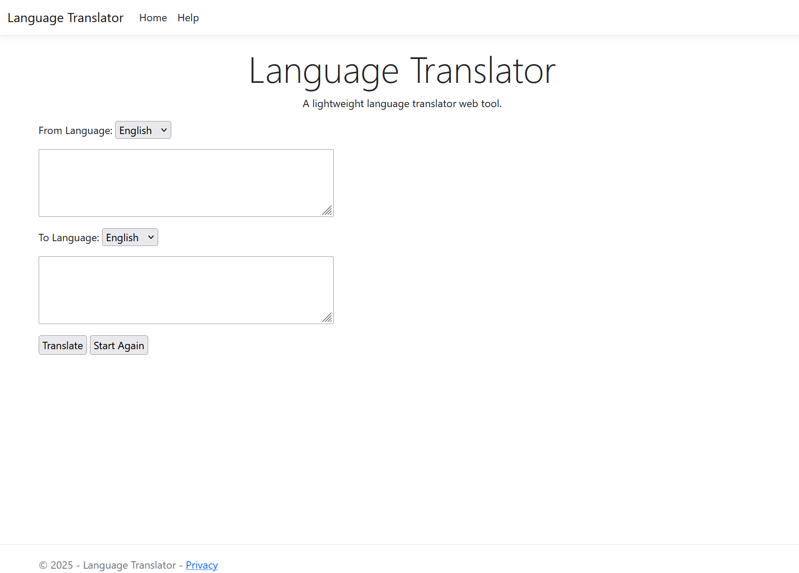
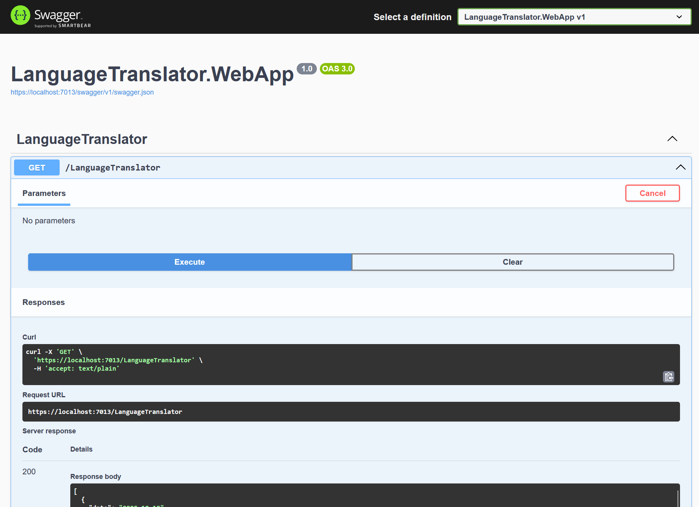

# Language Translator
A lightweight language translator web tool written in C#. 

## Features
- Copy and paste from the clipboard (if permitted).
- REST based API for external queries.
- Supports translations to Spanish, French and German.

## Screenshots

## Source Code
View the projects [Source Code](https://github.com/hayes0278/Language-Translator/tree/main/).

## Helpful Links
- [Development URL](https://localhost:7013/)
- [Swagger URL](https://localhost:7013/swagger)
- [Language Options List](https://api.cognitive.microsofttranslator.com/languages?api-version=3.0&scope=translation)

## How It Works
- User enters the text to translate into the textbox area.
- Set the destination languages, default is English.
- Read input from the user and perform the text translation.
- Display the result, or a message, to the user when complete.

## Limitations
- Does not have any security code needed for a production deployment.
- Azure key and region are in two different locations for the unit tests.

## Future Features
- Auto detect user entered source language.
- Supports 100 different translation languages.